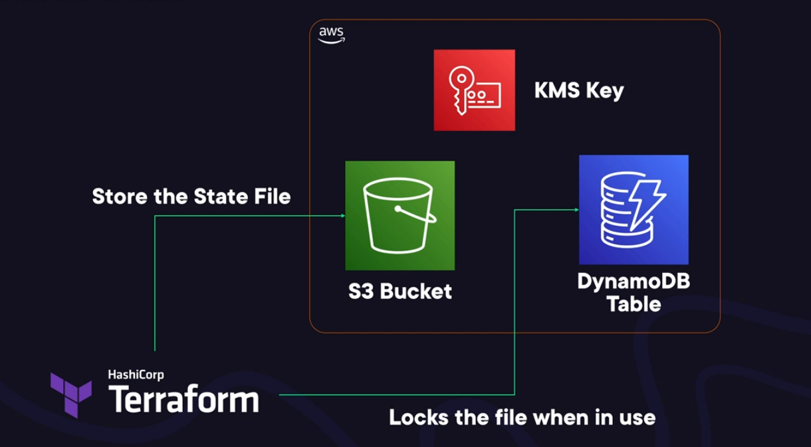

# Terraform Backend

- Why do we need to store terraform state  in dynamodb and it's already stored in s3 bucket?
becase DynamoDB has feature of locking on table or item so that you can only update a state file
at one time, not allowing other to update while is locking by another process.

- Why do we need to encrypt the state file in s3?
because it contains sensative data like password exists on outups or important resource and metatdata

- What you will do if you lost your state file terraform and all resource are running perfectly on the cloud?
the solution you have to import the resource to the new terraform state file one by one.
-- some important imports for the resource tricky like 
```sh
# import  route table assocication
terraform import aws_route_table_association.associate subnet-0fb3e607c0bf73416/rtb-0d37eca13abf0eef0

# associate the route
terraform import aws_route.route rtb-0d37eca13abf0eef0_0.0.0.0/0
```
- after you finished importing the resources to list them and confimr:
```terraform state list```
- to be more confirm and sure update one of the tags:
```sh
provider "aws" {
    default_tags {
        tags = {
            Environment = "demo"
            Project     = "demo-project"
            OwnedBy     = "DevOps"
        }
    }
}
```

## Install Backend
- To deploy backend run ./deploy.sh
```sh
S3 bucket: terraform-backend-terraformbackends3bucket-ykndtip5fke8
DynamoDB Table: terraform-backend-TerraformBackendDynamoDBTable-MHZH7M44HSIL
```
- Deploy backend configuration 
```sh
terraform {
  backend "s3" {
    bucket = "terraform-backend-terraformbackends3bucket-ykndtip5fke8"
    region = "us-east-1"
    dynamodb_table = "terraform-backend-TerraformBackendDynamoDBTable-MHZH7M44HSIL"
  }
}
```

- in case of you clicked "no" why deploy your state to s3 you can re-configure  your upload again using:
```sh
terraform init -reconfigure
```