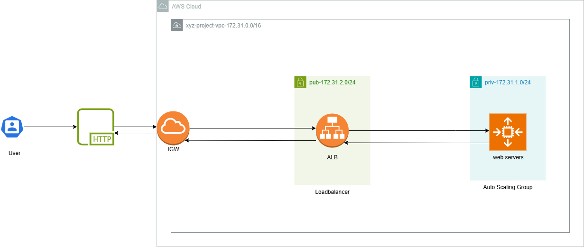
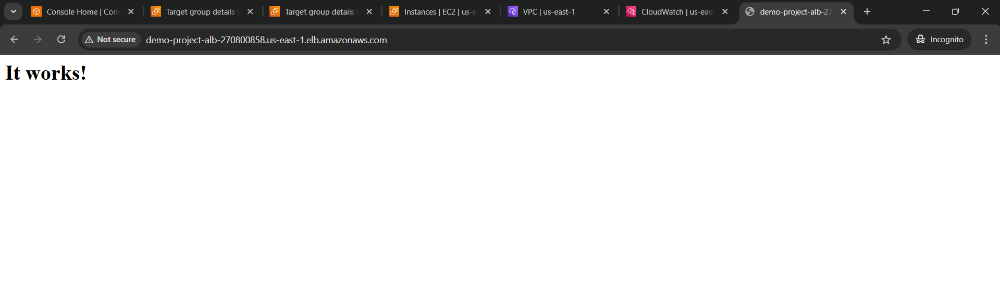

# Terraform Modules



## Connecting through SSH

I had faced  an issue to connecting one of the ec2 instance belong to the autoscaling group
so you have to use Bastion instance(deploy public ec2 instance in your network) to access your private instance.

## Requirements

- ALB
- ASG
  - Target Groups
- VPC with
  - one internet gateway
    - one Nat gateway
    - two  subnets public --> running in two different AZ
    - two subnets private --> running in two different AZ
- Optional (deploy ec2 instance as Bastion )
- Security groups
  - one for ALB
        - allow inbound port 80/443
    - one for ec2 instance ASG
      - open inbound for 80
      - open outboud for all traffic

## Important Notes

- change the health check type to ELB that will help the alb to check if the ec2 instance not working or not healthy
immdialty will create another instance, but when you set  the health check type only check the ec2 instance event if the
application is not healthy so will not give you an accurate result checking health.

```sh
health_check_type         = "ELB"
```

## After Deployment Success


