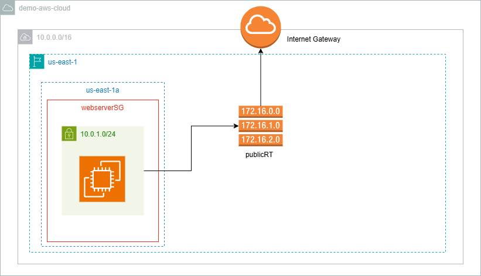

# Terraform Backend


```
.
├── main.tf
├── variables.tf
├── outputs.tf
├── modules
│   ├── vpc
│   │   ├── main.tf
│   │   ├── variables.tf
│   │   └── outputs.tf
│   ├── compute
│   │   ├── main.tf
│   │   ├── variables.tf
│   │   └── outputs.tf
│   └── s3
│       ├── main.tf
│       ├── variables.tf
│       └── outputs.tf

```

S3 bucket: terraform-backend-terraformbackends3bucket-el1irmchlzdc                                                                     
DynamoDB Table: terraform-backend-TerraformBackendDynamoDBTable-1VN5472I3FQAS

## Observation
- WHen you want accessing the out variables of the resource or module , you must put it on 
outputs file, then you'll be able to access it.

## Deploy
- deploy terraform backend
```bash
cd terraform-modules/init-backend
sudo chmod +x deploy.sh
./deploy.sh
```
- migrate terrafom state to a cloud
```sh
# init the backend of terraform
terraform init

# see the chagnes we are going to deploy
terraform plan 

# apply the chagnes
terraform apply --auto-approve
```
